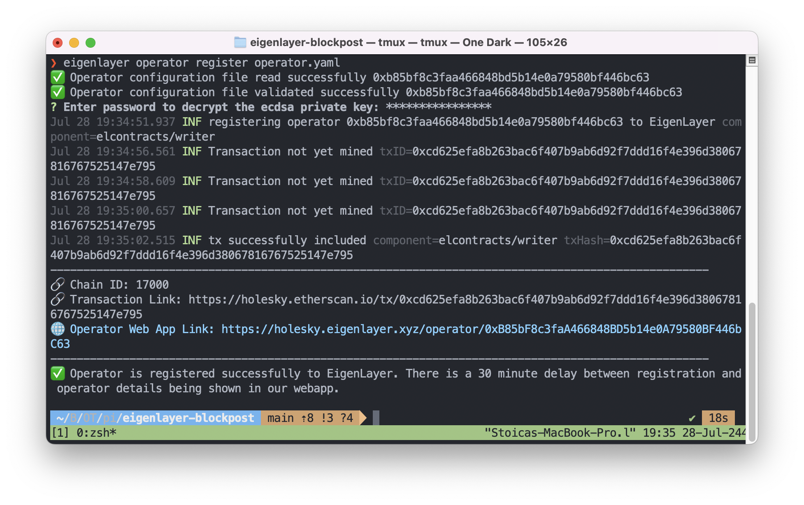

# BlockPost AVS

Simple EigenLayer AVS allowing users to store and retrieve messages on-chain. This repository has been forked from [Hello World AVS](https://github.com/Layr-Labs/hello-world-avs) and updated to support the required features as follows:

- New `BlockpostServiceManager` AVS smart contract which handles the message storage request and validation through the `createNewRequest` and `respondToRequest` methods;
- New Anvil deployments of both AVS and EigenLayer contracts using the following command:

```bash
make deploy-contracts-to-anvil-and-save-state
```

- Operator deployed on the EigenLayer network;

## How it works

There are 5 steps to this AVS:

- AVS consumer (user) requests a message to be stored on-chain using the `createNewRequest` method;
- AVS takes on the request by emitting a `MessageRequestCreated` event for operators to pick up the request;
- any operator who is staked to serve the BlockPost AVS takes this request and signs it;
- the operator submits this message with their signature back to the AVS using the `respondToRequest` method;
- _if the operator is in fact registered to the AVS and has the minimum needed stake, the submission is accepted_;

## Quick Start

### Dependencies

1. [npm](https://docs.npmjs.com/downloading-and-installing-node-js-and-npm)
2. [Foundry](https://getfoundry.sh/)
3. [Docker](https://www.docker.com/get-started/)
   - Make sure Docker is running

Following NodeJS packages:

1. tcs
2. ethers

### Steps

In order to manually test the AVS and operator workflow, follow the next steps:

1. Run `yarn install`
2. Run `cp .env.local .env`
3. Run `make start-chain-with-contracts-deployed`
   - This will build the contracts, start an Anvil chain, deploy the contracts to it, and leaves the chain running in the current terminal
4. Open new terminal tab and run `make start-operator`
   - This will compile the AVS software and start monitering new tasks
5. Open new terminal tab and run `make spam-tasks` (Optional)
   - This will spam the AVS with random names every 15 seconds

## Deploy AVS on Holesky Testnet

To deploy the Blockpost AVS contracts to the Holesky network, follow these steps:

1. Ensure you have the necessary RPC URL and private key for the Holesky network.
2. Run the deployment script using Foundry:
   ```bash
   forge script script/HoleskyDeployer.s.sol:HoleskyDeployer --rpc-url $RPC_URL --private-key $PRIVATE_KEY --broadcast -vvvv
   ```
   Replace `$RPC_URL` with your Holesky RPC URL and `$PRIVATE_KEY` with your private key.

## Deploy operator on EigenLayer network

Follow the next [tutorial](https://docs.eigenlayer.xyz/eigenlayer/operator-guides/operator-installation) on how to deploy the off-chain operator on the EigenLayer network.

After successful deployment, you should see the `Operator is registered successfully to EigenLayer` success message as displayed below:



## Holesky Testnet

The Blockpost AVS has been deployed on the Holesky Testnet and its address can be found in the next table:

| Contract Name             | Holesky Address                                                                                                               |
| ------------------------- | ----------------------------------------------------------------------------------------------------------------------------- |
| Blockpost Service Manager | [0xcbDbb24a52FD886438dB0C5fA490C2C35FB72eDa](https://holesky.etherscan.io/address/0xcbDbb24a52FD886438dB0C5fA490C2C35FB72eDa) |
| Delegation Manager        | [0xA44151489861Fe9e3055d95adC98FbD462B948e7](https://holesky.etherscan.io/address/0xA44151489861Fe9e3055d95adC98FbD462B948e7) |
| Avs Directory             | [0x055733000064333CaDDbC92763c58BF0192fFeBf](https://holesky.etherscan.io/address/0x055733000064333CaDDbC92763c58BF0192fFeBf) |
